Smooth Tileset for Gnome Mahjongg
=================================

This is an updated version of the script and images used to render the original
Smooth tileset for Gnome Mahjongg.  I have recently unearthed this script and updated
it to render with POVRay 3.7, and performed various other tweaks.

Prerequisites
-------------

 - Perl (5+)
 - POVRay (3.7+)
 - imagemagick

Samples
-------

### Circle Suit:
 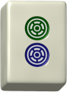 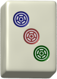 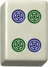 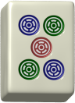 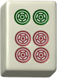 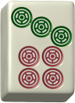 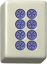 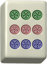

### Bamboo Suit:
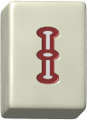 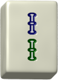  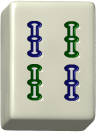 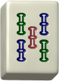  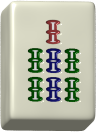  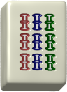

### Character Suit:
        

### Wind Tiles:
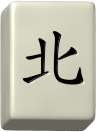  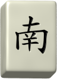 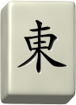

### Dragon Tiles:
  

### Flower Tiles:
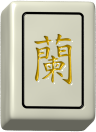 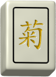 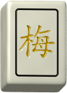 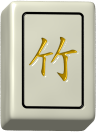

### Season Tiles:
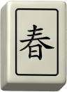 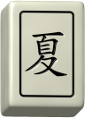  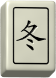

### Blank Tile:
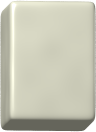

License
-------

Copyright &copy; 2004-2014 Jim Evins <evins@snaught.com>

smooth-tileset is free software: you can redistribute it and/or modify
it under the terms of the
[GNU General Public License](http://www.gnu.org/licenses/gpl-2.0-standalone.html)
as published by the Free Software Foundation, either version 2 of the License, or
(at your option) any later version.

smooth-tileset is distributed in the hope that it will be useful,
but WITHOUT ANY WARRANTY; without even the implied warranty of
MERCHANTABILITY or FITNESS FOR A PARTICULAR PURPOSE.  See the
GNU Lesser General Public License for more details.

You should have received a copy of the GNU General Public License
along with smooth-tileset.  If not, see <http://www.gnu.org/licenses/>.

